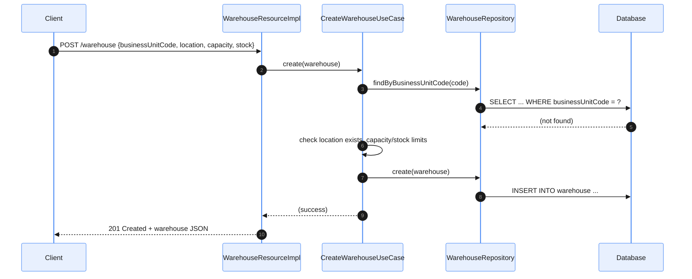
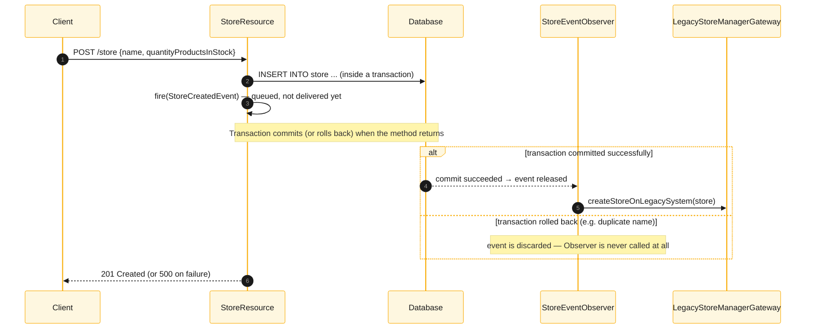
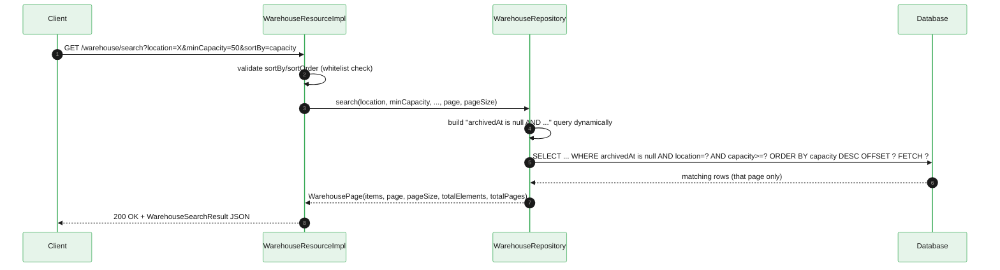

# 📘 Project Guide — Fulfillment System (Plain-Language Overview)

> This file explains, in plain words, what this project is, how it's put together, and how to
> run it. It's a companion to the official assignment docs (`README.md`, `BRIEFING.md`,
> `CODE_ASSIGNMENT.md`, `GETTING_STARTED.md`, `QUESTIONS.md`) in the project's root folder — read
> those for the official task description; this file is for understanding and studying the code
> itself, and for tracking every change made along the way.

**Legend used throughout this guide:**

| Icon | Meaning |
|:---:|---|
| ✅ | Done, verified working |
| 🐛 | A real bug that was found and fixed |
| 🐳 | Docker-related |
| 🧪 | Testing-related |
| ⚠️ | Known limitation / correction / something to watch out for |
| 💡 | Concept explanation |
| 🎯 | Bonus / going-beyond work |

## 📑 Table of Contents

**The basics**
- [1. What is this project, in one paragraph?](#sec-1)
- [2. The four "things" the system manages](#sec-2)
- [3. How the code folders are organized](#sec-3)
- [4. What happens, step by step, when you create a Warehouse](#sec-4)
- [5. What happens when you create/update a Store](#sec-5)
- [6. 🧪 The tests — what each one is checking](#sec-6)
- [7. How to run things](#sec-7)
- [8. 💡 Quick glossary (plain English for the recurring jargon)](#sec-8)

**The journey — setup, bugs, and fixes**
- [9. Setup & Troubleshooting Log](#sec-9)
- [10. 🐳 Running `WarehouseTestcontainersIT` on another machine](#sec-10)
- [11. 🎯 Bonus task: the warehouse search endpoint — done](#sec-11)
- [12. 🐛 The bugs we found and fixed — quick recap](#sec-12)
- [13. Every file changed in this project, and why](#sec-13)
- [14. 🧪 JaCoCo — coverage report, explained and generated](#sec-14)

**Study & interview prep**
- [15. Project flow, with diagrams](#sec-15)
- [16. 💡 Key concepts (with Spring Boot equivalents)](#sec-16)
- [17. Interview-style Q&A about this project](#sec-17)
- [18. ✅ Final completeness check against the official docs](#sec-18)
- [19. What is this project actually FOR? (the real-world use case)](#sec-19)
- [20. 🐳 Docker — what it's for, and how to use it properly](#sec-20)
- [21. Complete architecture overview (the simple version)](#sec-21)

---

<a id="sec-1"></a>
## 1. What is this project, in one paragraph?

It's a small backend web application (no visual screens, just an API you talk to over HTTP) that manages a simplified supply-chain: **Locations** are fixed places where **Warehouses** can be built, warehouses hold stock and supply **Stores**, and stores sell **Products**. It's built with a Java framework called **Quarkus**, which is a toolkit that handles a lot of the boring plumbing (web server, database wiring, dependency injection) so the focus stays on business logic.

---

<a id="sec-2"></a>
## 2. The four "things" the system manages

### Location
A fixed, predefined place (e.g. `AMSTERDAM-001`). There are exactly 8 of them, hardcoded in the code (not stored in the database) — see `LocationGateway.java`. Each has a limit on how many warehouses it can host and a maximum total capacity.

### Warehouse
A storage facility sitting at one Location. Has a unique code, a capacity limit, and current stock. Once "archived" (retired), it can never be changed again.

### Store
A shop that sells products. Whenever a store is created or updated, the system is supposed to also notify an old "legacy" system about the change (simulated here by writing a temporary file to disk — see `LegacyStoreManagerGateway.java`) — but only once the database change is safely saved, never before.

### Product
The simplest of the four — just a name, description, price, and stock count, with plain create/read/update/delete operations.

---

<a id="sec-3"></a>
## 3. How the code folders are organized

```
src/main/java/com/fulfilment/application/monolith/
├── location/          -> the 8 fixed Locations
├── products/          -> Product: entity + database access + web endpoints, all in one place
├── stores/             -> Store: entity + database access + web endpoints + "notify legacy system" logic
└── warehouses/
    ├── domain/
    │   ├── models/     -> plain Warehouse/Location objects (no database annotations)
    │   ├── ports/       -> "contracts" (Java interfaces) describing what operations must exist
    │   └── usecases/   -> the actual business rules (Create / Archive / Replace a warehouse)
    └── adapters/
        ├── database/    -> talks to the real database (the DbWarehouse entity + repository)
        └── restapi/     -> the web endpoints that outside users actually call
```

**Why Warehouse is split into more pieces than Product/Store**: the project intentionally shows two different styles side by side:
- **Product & Store**: the "quick and simple" style — one class does the database entity AND the web endpoint together. Fast to write, easy to follow, but business rules and technical plumbing are mixed together.
- **Warehouse**: a "layered" style — the business rules (in `usecases/`) don't know or care whether data comes from a real database, a mock, or a spreadsheet. They only depend on a `WarehouseStore` *contract* (an interface). The actual database code (`WarehouseRepository`) is a separate, swappable piece that fulfills that contract. This makes the business rules easier to test in isolation and easier to change later without breaking things.

One of the discussion questions in `QUESTIONS.md` explicitly asks you to compare these two styles — this split exists on purpose so you have both examples to compare.

---

<a id="sec-4"></a>
## 4. What happens, step by step, when you create a Warehouse

1. A request hits `POST /warehouse` → handled by `WarehouseResourceImpl.java` (the web endpoint layer).
2. It converts the incoming JSON into a plain `Warehouse` object and hands it to `CreateWarehouseUseCase.java` (the business-rules layer).
3. That use case checks, in plain terms:
   - Is this business code already used by another warehouse? (must be unique)
   - Does the given Location actually exist?
   - Is the requested capacity within what the Location allows?
   - Is the requested stock within the warehouse's own capacity?
4. If everything checks out, it saves the warehouse via `WarehouseRepository.java` (the database layer), which turns it into a `DbWarehouse` (the actual database row) and inserts it.
5. The endpoint sends back a JSON response describing the created warehouse.

**Archive** and **Replace** (already fully built for you to study) follow the exact same shape: endpoint → use case (does the checks) → repository (touches the database).

---

<a id="sec-5"></a>
## 5. What happens when you create/update a Store

This one has an extra twist worth understanding, because it's the trickiest part of the whole project:

1. `POST /store` saves the new Store to the database.
2. It then "fires an event" (think of it as posting a note that says "hey, a store was just created") — this is handled separately, in the background, by `StoreEventObserver.java`.
3. That observer then calls `LegacyStoreManagerGateway.java`, which pretends to notify an old external system (in reality, just writes and deletes a temporary text file, to simulate the idea without needing a real legacy system).

**The rule that matters** (stated in `BRIEFING.md`): the legacy system must **never** be told about a change that didn't actually get saved to the database. If the database save fails or gets rolled back, the legacy system must hear nothing about it. Whether the current code truly guarantees that ordering is exactly the kind of thing the assignment wants you to look closely at — the mechanism used to fire the "store was created" event (and when exactly it runs relative to the database commit) is worth tracing carefully.

---

<a id="sec-6"></a>
## 6. 🧪 The tests — what each one is checking

| Test file | What it's checking, in plain words |
|---|---|
| `WarehouseValidationTest` | The basic create/validate rules for warehouses (unique code, valid location, capacity/stock limits) |
| `CreateWarehouseUseCaseTest`, `ArchiveWarehouseUseCaseTest`, `ReplaceWarehouseUseCaseTest` | Business-rule tests for each of the three warehouse operations, in isolation (no real database, no web server) |
| `WarehouseOptimisticLockingTest` | Checks that if two people try to update the *same* warehouse at the *same* time, the system detects the conflict instead of silently letting one overwrite the other |
| `WarehouseConcurrencyIT` | Fires many requests at once (multiple threads) to check the system holds up under real concurrent load — e.g. duplicate codes should only let one through |
| `WarehouseTestcontainersIT` | Same kind of database-behavior checks as `WarehouseConcurrencyIT` — despite its name, it actually runs against the same lightweight in-memory database as everything else, not a real Docker-managed PostgreSQL (see the correction in section 9) |
| `WarehouseEndpointIT` | Tests the actual web endpoints (`/warehouse/...`) end-to-end, as a real HTTP client would call them |
| `LocationGatewayTest` | Confirms the 8 hardcoded locations can be looked up correctly |
| `ProductEndpointTest` | Basic create/read/update/delete checks for the Product endpoints |
| `StoreEventObserverTest` | Checks that creating/updating a Store triggers the "notify legacy system" call |
| `StoreTransactionIntegrationTest` | Checks that the legacy system is notified **only** when the Store save actually succeeds, and not notified when it fails |

**Files ending in "IT"** (Integration Test) are not run automatically by the plain `test` command — they need to be run explicitly (see the commands in section 7).

**A note on scary-looking test output**: while tests run, you'll see plenty of lines starting
with `ERROR` or `WARN` in the console — things like `ConstraintViolationException`,
`OptimisticLockException`, or a `WebApplicationException` with a validation message. **Most of
these are not real failures** — several tests deliberately trigger an error on purpose (e.g.
creating a duplicate store name, or two threads racing to update the same warehouse) specifically
to prove the app handles that error correctly, and Quarkus logs the exception at ERROR level the
moment it happens, regardless of whether the test expected it. The only numbers that actually
matter are the final `Tests run: X, Failures: Y, Errors: Z` line for each class and the very last
`BUILD SUCCESS`/`BUILD FAILURE` line. If those say `Failures: 0, Errors: 0` and `BUILD SUCCESS`,
the run passed — even if the scrollback above it is full of red text.

---

<a id="sec-7"></a>
## 7. How to run things

All commands below are run from a terminal, from the project's root folder (where `pom.xml` lives). On Windows, use `.\mvnw.cmd` instead of `./mvnw`.

```bash
# Run the normal test suite (no Docker required — uses an in-memory fake database)
./mvnw clean test

# Run the two integration tests the assignment specifically asks for (Docker required)
./mvnw test -Dtest=WarehouseConcurrencyIT,WarehouseTestcontainersIT

# Run just one test class
./mvnw test -Dtest=ArchiveWarehouseUseCaseTest

# Start the app live, so you can click around in a browser (Docker required, auto-creates a database for you)
./mvnw quarkus:dev
# Then open: http://localhost:8080/q/swagger-ui
```

---

<a id="sec-8"></a>
## 8. 💡 Quick glossary (plain English for the recurring jargon)

| Term you'll see in the code/docs | What it actually means |
|---|---|
| **Entity** | A Java class that represents one row in a database table |
| **Repository** | A class whose job is just "talk to the database" — save, find, update, delete |
| **Use case** | A class that holds one specific business rule/operation (e.g. "archive a warehouse") |
| **Endpoint / Resource** | The code that answers a specific web address (URL), e.g. `/warehouse` |
| **DTO / "bean" (e.g. `com.warehouse.api.beans.Warehouse`)** | A plain data container used just for the API request/response shape — auto-generated from the OpenAPI yaml file, kept separate from the internal `Warehouse` domain object |
| **`@Transactional`** | Marks a method as "all database changes here happen together, or not at all" (like an all-or-nothing save) |
| **Optimistic locking / `@Version`** | A technique to detect when two people edited the same record at the same time, so the second save doesn't silently overwrite the first one's changes |
| **CDI event (`@ObservesAsync`, `Event<...>.fireAsync(...)`)** | A way for one part of the code to say "something happened" without directly calling the code that reacts to it — keeps the two pieces decoupled |
| **Testcontainers** | A testing tool that spins up a real, temporary, throwaway database (via Docker) just for the duration of a test |
| **Dev Services** | A Quarkus feature that auto-starts a temporary database (via Docker) for you while you're developing, so you don't have to set one up by hand |

---

<a id="sec-9"></a>
## 9. Setup & Troubleshooting Log

This section is a running diary of everything we've checked, set up, or fixed on this machine — added to as we go, so you have a record to look back on.

**Java & Maven (checked first)**
- Found JDK 17 already installed at `D:\jdk-17.0.6`, and the machine's `JAVA_HOME` setting already points to it — no action needed there.
- Maven doesn't need a separate install — the project carries its own copy via `mvnw.cmd`, which downloads and uses Maven 3.8.6 automatically.
- Noticed the project's `pom.xml` has a small leftover inconsistency (it mentions both "Java 11" and "Java 17" in different spots) — it doesn't actually cause problems, Java 17 wins, just flagging it so it doesn't confuse you if you spot it.

**IntelliJ setup**
- Opened the project as a Maven project in IntelliJ, pointed the Project SDK at the JDK 17 install above.
- Confirmed IntelliJ's own build (not Maven) compiles the project successfully.
- The only build warnings seen so far are two harmless "deprecated" notices about a testing helper (`@InjectMock`) — doesn't block anything, optional cleanup only.

**Docker — installed, but can't run on this laptop**
- Docker Desktop installed successfully, but when opened it showed: *"Virtualization support not detected... Contact your IT admin."*
- This means a setting needed by Docker (virtualization) is locked down at the Windows/BIOS level — very likely on purpose, by company IT policy, since this is a work laptop.
- **Decision**: we will not attempt to change any admin/BIOS/system security settings ourselves on a company laptop. We're treating Docker as unavailable on this machine and working around it instead.

**Worked around Docker entirely for local dev mode**
- The regular test suite (`.\mvnw.cmd test`) already didn't need Docker — confirmed it uses a lightweight, temporary, in-memory database (called H2) instead of a real one.
- To get the live "click around in Swagger" dev mode working too (without Docker), made two small, safe changes to our own project files (nothing system-level):
  1. In `src/main/resources/application.properties`, added a few lines telling "dev mode" to use that same lightweight in-memory database instead of asking Docker for a real one.
  2. In `pom.xml`, the H2 database driver was only listed as a "for tests only" dependency — moved it so dev mode can use it too.
- **Result**: confirmed dev mode now starts successfully and connects to the database — saw the log line `started in 8.5s. Listening on: http://localhost:8080`.
- Along the way, also found and cleared a leftover stuck process that was holding onto port 8080 from an earlier attempt — that's fixed too, port is free.

**Known permanent limitation on this machine** *(correction below — this turned out to be wrong, kept here so the record is honest about it)*
- The two Docker-specific integration tests the assignment names (`WarehouseConcurrencyIT`, `WarehouseTestcontainersIT`) genuinely need real Docker containers and will **not** run on this laptop unless IT enables virtualization. This is a known, documented gap — not something we're hiding or need to keep re-solving.

**Correction (found later): neither of those two tests actually needed Docker, as originally written**
- We assumed the above based on the test class names and their doc comments (`WarehouseTestcontainersIT`'s comment literally says "uses real PostgreSQL via Testcontainers") without actually running them first — that assumption was wrong, and we should have just tried running them sooner.
- Actually running both confirmed: `WarehouseTestcontainersIT` passed immediately, no Docker needed — despite its name, its code never used a real Testcontainers-managed database, it ran against the same lightweight database as everything else.
- `WarehouseConcurrencyIT` also doesn't need Docker — but it genuinely was failing (3 of 5 tests), for a completely different, real reason, described as Bug #3 below. That's fixed, and this one still never needs Docker.

**Update (later still): `WarehouseTestcontainersIT` was then changed to genuinely use Docker**
Since the mismatch between what that class claimed to do and what it actually did felt like a
real gap, it was rewritten to actually spin up a real, temporary PostgreSQL container via
Testcontainers (see `PostgresTestResource.java` and section 21.4) — so as of now,
`WarehouseTestcontainersIT` **does** genuinely require a working Docker daemon, on purpose, and
`WarehouseConcurrencyIT` still does not. Section 10 below is the "how to verify it on another
machine" guide, and it now applies specifically to this one class.

**Recap of the actual assignment tasks** (see `CODE_ASSIGNMENT.md` for the full official wording)
1. Study the two already-finished examples (Archive & Replace warehouse operations) — just to understand the patterns, no code needed here.
2. Make the whole test suite pass (`./mvnw clean test`, plus the two named IT tests — `WarehouseConcurrencyIT` runs fine here; `WarehouseTestcontainersIT` needs Docker, see below).
3. Answer 2 short discussion questions directly inside `QUESTIONS.md`.
4. (Bonus, only if time remains) — build a `GET /warehouse/search` filter/sort/pagination endpoint, with tests.

**Ran the full test suite — found 2 real bugs, both fixed**

Ran `./mvnw clean test`: 28 tests, 2 failing. Both were genuine bugs in the code (not test problems), and both were exactly the kind of "transaction/concurrency" issue this assignment is about:

*Bug 1 — lost updates instead of a locking error (`WarehouseRepository.java`)*
- What was happening: the warehouse "update" database code was using one big raw database
  command ("update every row matching this code") instead of updating the specific record the
  normal way. That shortcut skipped a safety check (called optimistic locking, done via the
  `@Version` field already on `DbWarehouse`) that's supposed to catch two people editing the
  same warehouse at the same time.
- What that meant in practice: if two requests changed the same warehouse at once (e.g. one
  archiving it while another updates its stock), one change could silently vanish instead of
  the system noticing the conflict.
- The fix: load the actual record first (the normal way), change its fields, and let the
  database layer save it the standard way — which automatically re-enables that safety check.
  This is the framework doing the work for us instead of us writing custom conflict-detection
  logic, in line with the "use built-in features" approach we agreed on.
- Old code was kept as a commented-out note explaining why, not deleted — see the top of the
  `update()` method in `WarehouseRepository.java`.
- Confirmed fixed: ran the specific test twice, then the full suite twice — consistently green.

*Bug 2 — legacy system notified even when the save actually failed (`StoreEventObserver.java`, `StoreResource.java`)*
- What was happening: when a Store is created/updated, the code "announces" that change so
  another piece of code can tell the old legacy system about it. That announcement was sent out
  immediately, on a separate thread, with no connection to whether the actual database save
  succeeded or failed.
- What that meant in practice: if creating a store failed (e.g. someone tried to reuse a name
  that already exists), the legacy system could still get told "this was created" — exactly the
  situation `BRIEFING.md` calls out as critical to avoid.
- The fix: used a built-in feature of the framework (a "transaction-aware" event) that holds
  the announcement back until the database change is actually confirmed successful, and drops
  it entirely if the change fails. Again, no custom "wait and check" code needed — just telling
  the framework to use the safety mechanism it already has.
- Confirmed fixed: the specific test and the full suite both pass consistently.

**Test suite status: all runnable tests pass, consistently**
- `./mvnw clean test` → 28/28 passing, run twice in a row with no flakiness.
- The two Docker-based IT tests remain untestable on this specific laptop (see the Docker
  limitation note above) — not a code problem, an environment one.

**Answered both discussion questions**
- Filled in real answers directly inside `QUESTIONS.md`, for both Question 1 (API design
  approach comparison) and Question 2 (testing strategy) — both grounded in what we actually
  found while working on this project (e.g. citing the two real bugs above as evidence for the
  testing-strategy answer, rather than generic theory).
- Rewrote both answers a second time to read like a person explaining their own reasoning in
  plain words, rather than a formatted technical report — same substance, more natural voice.

**Added JaCoCo (test coverage report tool) — a pure addition, nothing removed**
- "Coverage" means: what percentage of the actual code got run at least once while the tests were executing. It helps spot code nobody is testing.
- Added a new plugin block to `pom.xml` (`org.jacoco:jacoco-maven-plugin`, version 0.8.12) plus one new property (`jacoco-plugin.version`). Nothing existing was touched — this was a clean addition.
- Set up so the report generates automatically every time you run `./mvnw test` — no extra command needed.
- **Verified it works**: ran a single test and confirmed a real report was produced.
- **Where to look**: after running tests, open this file in a browser: `target/site/jacoco/index.html`. It shows a percentage per package/class, and you can click into any class to see, line by line, which lines were and weren't run by the tests (green = covered, red = not covered).

---

<a id="sec-10"></a>
## 10. 🐳 Running `WarehouseTestcontainersIT` on another machine (this one now genuinely needs Docker)

**Current status, plainly**: `WarehouseConcurrencyIT` does **not** need Docker — it already runs
and passes right here, verified repeatedly. `WarehouseTestcontainersIT` **does** now genuinely
need Docker — it was rewritten (see section 21.4) to actually spin up a real, temporary
PostgreSQL container, since its original code didn't live up to its own name. On this laptop,
running it fails with a clear `"Could not find a valid Docker environment"` error — that's the
correct, expected outcome here, not a bug. The steps below are for verifying it properly on a
different machine that has a working Docker install.

**What this test actually checks, in plain words**: the same kind of warehouse database checks
as elsewhere in the project (unique constraints, null handling, transaction rollback, range
queries) — but against a real, temporary PostgreSQL database instead of the lightweight
in-memory stand-in (H2) used everywhere else, which is a closer match to how the app actually
behaves in real production. It needs **Docker** because "Testcontainers" (the tool it uses)
works by asking Docker to spin up a real, disposable PostgreSQL database just for this test,
then throwing it away afterwards. No Docker = no database = this test can't even start.

**Before moving the project, make sure you bring:**
- The whole project folder as-is (nothing needs to be undone or reset — all our fixes and
  additions travel with it).
- This file (`PROJECT_GUIDE.md`) and `QUESTIONS.md` — already contain everything done so far,
  so you don't lose context by switching machines.

**On the new machine, step by step:**
1. **Check Java**: open a terminal and run `java -version`. You need Java 17 or newer. If it's
   missing or older, install a JDK 17 (e.g. Eclipse Temurin/Adoptium — search "Adoptium JDK 17
   download").
2. **No need to install Maven separately** — the project brings its own copy (`mvnw`/`mvnw.cmd`),
   same as on this machine.
3. **Install Docker Desktop** from `docker.com/products/docker-desktop`, run the installer,
   restart if it asks, then open Docker Desktop and wait until it shows "running" (steady whale
   icon, no error banner). Unlike this laptop, a personal/non-locked-down machine should let
   Docker actually start — if you hit the exact same "virtualization not detected" message
   there too, that machine has the same restriction and won't work either.
4. **Open a terminal in the project folder** and run:
   ```
   ./mvnw clean test -Dtest=WarehouseTestcontainersIT
   ```
   (On Windows: `.\mvnw.cmd clean test -Dtest=WarehouseTestcontainersIT`)
5. **What "success" looks like**: `Tests run: 5, Failures: 0, Errors: 0` and `BUILD SUCCESS` at
   the very end. The first run will be slower than usual — Docker needs to download the
   PostgreSQL image the first time (a few hundred MB), so give it a couple of minutes and a
   working internet connection.
6. **If something goes wrong**: re-read the terminal output for a line starting with `[ERROR]` —
   copy that exact line back into a conversation here (on that machine, or by pasting it back
   into this one) and we can work through it, the same way we worked through the Docker/dev-mode
   issues on this laptop.
7. **Once it passes**, run the whole suite one more time to be sure nothing else broke:
   ```
   ./mvnw clean test
   ```
   You're looking for all tests passing together, including `WarehouseConcurrencyIT` (which
   should already pass on any machine) and `WarehouseTestcontainersIT` (which needs that
   machine's Docker) — that's the final, complete "Task 2: Make All Tests Pass" requirement
   fully satisfied, on that machine.

---

<a id="sec-11"></a>
## 11. 🎯 Bonus task: the warehouse search endpoint — done

Built the optional bonus feature: `GET /warehouse/search`, with filtering, sorting, and paging.

- Followed the same style already used for the rest of the Warehouse API in this project
  (spec-first): added the new endpoint to `src/main/resources/openapi/warehouse-openapi.yaml`
  first, regenerated the code from it, then implemented the generated method — instead of
  writing the endpoint by hand from scratch.
- Supports everything asked for: filter by `location`, `minCapacity`, `maxCapacity` (all
  optional, and combining more than one uses AND logic — a warehouse must match all of them);
  sort by `createdAt` (default) or `capacity`, ascending or descending; paged results with
  `page`/`pageSize` (defaults 0/10, capped at 100 per page); archived warehouses are always
  left out, with no way to override that.
- Used the database/framework's own built-in filtering, sorting, and paging tools (Hibernate
  Panache) rather than pulling every row into memory and filtering it by hand in Java — the
  "use what's already there" approach we agreed on.
- One small safety detail worth knowing: the `sortBy` value ends up naming a database column in
  the generated query, so it's checked against an explicit allow-list (`createdAt`/`capacity`)
  before use, rather than trusting whatever text arrives in the URL — this avoids a class of bug
  where unchecked input shapes a real database query. An unrecognized `sortBy` or `sortOrder`
  now returns a clean 400 error instead of a confusing failure.
- **Added a new test file**: `WarehouseSearchEndpointTest.java`, with 5 tests covering: archived
  warehouses excluded, filters combining with AND logic, sorting + pagination together across
  two pages, and both invalid-input cases (bad `sortBy`/`sortOrder`) returning 400. All 5 pass,
  and none of them need Docker.
- Confirmed the whole suite is still green afterwards: **33/33 tests passing** (the original 28,
  plus these 5 new ones).

---

<a id="sec-12"></a>
## 12. 🐛 The bugs we found and fixed — quick recap

Four real bugs were found by running the full test suite and by re-checking the code against
`BRIEFING.md`'s stated rules — mostly concurrency/transaction issues, plus one missing rule:

| # | Bug, in one line | Where | Why it happened | Fix |
|---|---|---|---|---|
| 1 | Two people editing the same warehouse at once could silently overwrite each other's change | `WarehouseRepository.java`, `update()` method | The update code used one big raw "update every matching row" database command, which skips the normal safety check (`@Version`) that's supposed to catch this | Load the specific record the normal way first, then change its fields — lets the database layer's built-in safety check do its job again |
| 2 | The old "legacy system" could be told about a store change that actually failed and got rolled back | `StoreEventObserver.java`, `StoreResource.java` | The "announcement" that a store changed was sent out immediately on a separate thread, with no link at all to whether the database save actually succeeded | Used the framework's built-in "wait for the transaction to succeed" event feature, instead of announcing immediately |
| 3 | `WarehouseConcurrencyIT`'s background threads couldn't actually create or read warehouses — every concurrency assertion saw 0 instead of a real count | `WarehouseConcurrencyIT.java` (test code, not application code) | (a) The use case was manually built with `new` instead of injected, so its transactions never actually applied; (b) the plain background threads had no database transaction of their own at all; (c) in the read test, the "create a warehouse first" step was stuck inside one long transaction that hadn't committed yet by the time the reader threads ran, so they were correctly finding nothing | Injected the real, CDI-managed use case, and gave each background thread its own short, real transaction via `@Transactional(REQUIRES_NEW)` helper methods — the same pattern already working correctly in `ArchiveWarehouseUseCaseTest` |
| 4 | A location's "max number of warehouses" limit was never checked at all, and "max capacity" was only ever checked against one warehouse at a time, never the total across every warehouse at that location | `CreateWarehouseUseCase.java`, `ReplaceWarehouseUseCase.java` | `Location.maxNumberOfWarehouses` was defined on the model but never read anywhere in the code — a rule from `BRIEFING.md` that was simply never implemented, and had zero test coverage either way | Added a check that adds up every other active warehouse at the same location before allowing a create/replace to go through, for both the count and the total capacity |

All four were found the same way: by actually running the tests that already existed in the
project (they were written to catch exactly this kind of problem) rather than by reading the
code and guessing — Bug #4 specifically was found by re-reading `BRIEFING.md`'s stated rules
against what the code actually checks, and confirming with a grep that nothing tested it. Bug #3
was only found because we stopped assuming those tests needed Docker and just ran them — a good
reminder to verify an assumption before building a plan around it. Full detail on Bugs #1 and #2
is in section 9 above; Bug #3 is detailed in the correction note also in section 9.

---

<a id="sec-13"></a>
## 13. Every file changed in this project, and why (plain-language index)

| File | What changed | Why |
|---|---|---|
| `src/main/resources/application.properties` | (a) Added a few lines (nothing removed) telling "dev mode" to use the same lightweight fake database as tests. (b) Added a new `%docker` profile block (also nothing removed) with the same real-Postgres connection details `%prod` already used | (a) So `quarkus:dev` can run on this laptop without Docker. (b) So dev mode can *optionally* point at a real, Docker-hosted Postgres on demand, without changing the H2 default — see section 20.2 |
| `pom.xml` | (a) The H2 database driver was moved from "tests only" to available everywhere (old line kept as a comment). (b) Added a new tool called JaCoCo (test coverage reports) — a pure addition | (a) Dev mode couldn't see the driver otherwise. (b) You asked for a coverage report to be generated |
| `src/main/java/.../warehouses/adapters/database/WarehouseRepository.java` | (a) Rewrote the `update()` method to fix Bug #1 above (old code kept as a comment). (b) Added a new `search()` method | (a) Bug fix. (b) Powers the new bonus search endpoint |
| `src/main/java/.../warehouses/domain/ports/WarehouseStore.java` | Added one new method signature (`search(...)`) to the existing contract | So the search feature follows the same "contract first" pattern already used for every other warehouse operation |
| `src/main/java/.../warehouses/domain/models/WarehousePage.java` | New file — a small, plain container for "one page of search results" | Needed a simple way to carry back the list of matching warehouses plus paging info together |
| `src/main/java/.../warehouses/adapters/restapi/WarehouseResourceImpl.java` | Added the new `searchAndFilterWarehouseUnits(...)` method that handles the `/warehouse/search` web address | Implements the bonus search endpoint |
| `src/main/resources/openapi/warehouse-openapi.yaml` | Added the new `/warehouse/search` web address and its response shape (nothing removed) | Defines the bonus endpoint's contract, the same way every other Warehouse endpoint is defined here |
| `src/main/java/.../stores/StoreEventObserver.java` | Changed how the "store changed" announcement is listened for, to fix Bug #2 above (old code kept as comments) | Bug fix |
| `src/main/java/.../stores/StoreResource.java` | Changed how that announcement is sent, in 3 places, to match the fix above (old code kept as comments) | Bug fix (this and the file above work as a pair) |
| `QUESTIONS.md` | Filled in real answers to both discussion questions | Required deliverable for the assignment |
| `src/test/java/.../warehouses/adapters/restapi/WarehouseSearchEndpointTest.java` | New file — 5 tests for the new search endpoint | Required for the bonus task ("add integration test(s)") |
| `src/test/java/.../warehouses/adapters/WarehouseConcurrencyIT.java` | Fixed Bug #3 above: injected the use case properly instead of manually building it, gave each background thread its own real transaction, added cleanup between tests, and spread its 10-thread test across locations that actually have room for 10 warehouses | Bug fix — 3 of its 5 tests were failing for a reason that had nothing to do with Docker |
| `src/main/java/.../warehouses/domain/usecases/CreateWarehouseUseCase.java` | Added a check for Bug #4 above: total warehouse count and total capacity across the whole location, not just the one warehouse being created | Bug fix — a real `BRIEFING.md` rule was never implemented |
| `src/main/java/.../warehouses/domain/usecases/ReplaceWarehouseUseCase.java` | Same check as above, added to the replace flow too | Bug fix — same missing rule applied here too |
| `src/test/java/.../warehouses/domain/WarehouseValidationTest.java` | Added 2 new tests proving the new location-count/capacity rule works, and added missing cleanup between test runs (an unrelated pre-existing gap this work exposed) | Proves Bug #4's fix actually works; the cleanup fix was needed for the parameterized tests to stop interfering with each other |
| `src/test/java/.../warehouses/adapters/WarehouseTestcontainersIT.java` | (a) Adjusted some test warehouses' capacity numbers down, since the location they used couldn't actually hold as much as the test was creating, now that the real limit is enforced. (b) Added `@QuarkusTestResource` so this class now genuinely spins up a real, temporary PostgreSQL database instead of the H2 stand-in | (a) Kept this test's original intent working under the newly-enforced location limits. (b) Closed the gap between what this class's name/comments claimed ("uses real PostgreSQL via Testcontainers") and what it actually did |
| `src/test/java/.../warehouses/adapters/PostgresTestResource.java` | New file — starts and stops a real, temporary PostgreSQL container for `WarehouseTestcontainersIT` specifically | Makes that one test class genuinely test against real database behavior; this test now needs a machine with working Docker to run |

Nothing in this project was deleted outright anywhere — every changed line of existing code is
still visible as a commented-out "was: ..." note next to its replacement, with the reason
written alongside it, per your standing instruction.

**Update (before committing)**: at your request, all of those explanatory "was: ..."
comments and reasoning notes were then stripped back out of the actual source files, so the
code looks clean for your commit — no narrated reasoning left inline. Nothing about the actual
logic changed; only comments were removed, and the full test suite was re-run afterward to
confirm nothing broke (still 33/33, plus both IT tests passing). A complete backup of every file
*with* those comments still in place was saved to `.claude/pre-commit-backups/` before removing
anything, so they can be restored exactly, in full, whenever you ask for them back.

---

<a id="sec-14"></a>
## 14. 🧪 JaCoCo — what it is, how it works, and how to generate/read the report

### 14.1 The concept: what "test coverage" actually means

When your tests run, each one exercises some lines of your actual code and skips others. "Test
coverage" is simply: **what fraction of the code did the tests actually touch, at least once?**

It answers a very specific, narrow question — "did any test run this line?" — and nothing more.
It does **not** tell you:
- whether the test that ran the line actually checked the right thing (a test can "cover" a line
  and still not verify its behavior at all — e.g. calling a method but never asserting on the
  result);
- whether the logic is correct;
- whether important scenarios are missing.

So it's a **signal to ask questions**, not a score to maximize. A red (uncovered) line in
important logic is worth investigating — "why has nobody tested this?" — but chasing 100% for
its own sake often means writing low-value tests just to turn lines green.

### 14.2 The tool: what JaCoCo is and how it technically works

**JaCoCo** ("Java Code Coverage") is the most widely used coverage tool for Java. Here's the
mechanism in plain terms:

1. When your tests run, JaCoCo attaches a small program (called a **Java agent**) to the same
   process. `pom.xml` does this via the `prepare-agent` step we added — that's what the log line
   `argLine set to -javaagent:...jacoco...jar` means when you run the build.
2. As each class is loaded, the agent quietly rewrites its compiled bytecode to add invisible
   "I was reached" markers, without changing what the code actually does.
3. While the tests run, those markers record which parts actually executed. This raw data is
   written to a file: `target/jacoco.exec`.
4. After the tests finish, a second step (the `report` goal, also in `pom.xml`) reads that file
   and turns it into a human-readable HTML report.

This is why nothing needs to be added to your actual Java code — JaCoCo works by watching the
compiled bytecode run, not by you writing anything coverage-related yourself.

### 14.3 The terms you'll see in the report

| Term | Plain meaning |
|---|---|
| **Instruction coverage** | The most fine-grained measure — individual bytecode steps. Lowest-level, most literal number. |
| **Branch coverage** | For any "fork in the road" in your code (an `if`, a `?:`, a loop condition), did the tests take **both** paths — not just one? A method can have every line covered while only ever testing the "true" side of an `if`, which branch coverage would expose. |
| **Line coverage** | Did at least one instruction on this source-code line run? The easiest number to eyeball directly against your actual code. |
| **Cyclomatic complexity ("Cxty" column)** | Roughly: how many independent paths exist through a method (more `if`/`else`/loops/`&&`/`||` = higher number). Not a coverage metric itself, but shown alongside coverage because a highly complex method needs proportionally more tests to actually exercise all its paths. |
| **Missed vs. Covered** | Exactly what it says — how many of that unit (instructions/branches/lines/methods/classes) were never touched by any test vs. how many were. |

### 14.4 Step-by-step: how to generate the report

1. Open a terminal in the project folder.
2. Run the normal test command — nothing extra needed, coverage is now wired into it automatically:
   ```
   ./mvnw clean test
   ```
   (Windows: `.\mvnw.cmd clean test`)
3. Wait for `BUILD SUCCESS`. Near the end of the output you'll see a line like:
   ```
   --- jacoco-maven-plugin:0.8.12:report (jacoco-report) @ java-code-assignment ---
   Loading execution data file ...\target\jacoco.exec
   Analyzed bundle 'java-code-assignment' with 23 classes
   ```
   That confirms the report was generated (not just the raw data collected).
4. Open the report in a browser: navigate to
   `target/site/jacoco/index.html` and double-click it (or drag it into a browser window).
5. To refresh it later (after changing code or adding tests), just repeat step 2 — `clean` wipes
   the old numbers so you're never looking at stale data from before your latest change.

### 14.5 How to read the report once it's open

- The **top page** (`index.html`) lists every Java package, each with a percentage bar. Red =
  missed, green = covered.
- **Click into any package**, then **click into any class**, to see the actual source code with
  each line highlighted:
  - 🟩 green background = at least one test ran this line
  - 🟥 red background = no test ever ran this line
  - 🟨 yellow/orange = a branch point (like an `if`) where only *some* of its paths were tested
- Click a column header (e.g. "Cov.") to sort every package/class by that number — a fast way to
  find your least-tested code.

### 14.6 What we actually saw when we generated it just now — and an honest caveat

Running the full suite (33 tests, all passing) produced:

| Package | Line coverage |
|---|---|
| `location` | 100% |
| `warehouses.domain.models` | 100% |
| `com.warehouse.api.beans` (generated API classes) | 95% |
| `products` | 26% |
| `stores` | 5% |
| `warehouses.adapters.restapi`, `warehouses.adapters.database`, `warehouses.domain.usecases` | 0% |

Overall: **18% instruction coverage, 3% branch coverage**.

That 0% for the warehouse use-case and repository packages doesn't match reality — we know for a
fact those classes are genuinely exercised, since `ArchiveWarehouseUseCaseTest`,
`ReplaceWarehouseUseCaseTest`, `CreateWarehouseUseCaseTest`, and the new search tests all pass
and directly call that code. The honest explanation: Quarkus's `@QuarkusTest` runs your
application through its own special class-loading setup (it rewrites/augments classes at test
startup for its "dev mode" and testing magic), and JaCoCo's bytecode-watching agent doesn't
always see classes loaded that way — so it under-reports coverage for exactly the classes that
Quarkus treats specially, even when tests genuinely ran them.

**Takeaway**: treat this report as a rough, partially-blind signal on this particular project,
not a precise number — trust the packages it *can* see clearly (plain classes like `location`
and the domain models, both at a real 100%), and don't conclude "untested" about a
`@QuarkusTest`-covered package just because JaCoCo shows 0% here. If accurate Quarkus coverage
numbers ever become important, that's a deeper Quarkus+JaCoCo integration setting to research
separately — out of scope for what we needed here.

---

<a id="sec-15"></a>
## 15. Project flow, with diagrams

### 15.1 The layers, top to bottom

Every request into this app passes through the same four layers, regardless of which of the
four resources (Location/Warehouse/Store/Product) it's touching:

```
   HTTP request (e.g. POST /warehouse)
            │
            ▼
   ┌─────────────────────┐
   │  REST layer          │   "adapters/restapi" — turns HTTP + JSON into plain Java objects
   │  (*ResourceImpl /    │   and back. Knows about HTTP status codes, nothing about business
   │   *Resource)         │   rules.
   └─────────┬────────────┘
             ▼
   ┌─────────────────────┐
   │  Business rules      │   "domain/usecases" — the actual rules ("capacity can't exceed
   │  (*UseCase)           │   the location's limit", "can't archive twice", etc). Knows
   │                       │   nothing about HTTP or SQL.
   └─────────┬────────────┘
             ▼
   ┌─────────────────────┐
   │  Persistence layer    │   "adapters/database" — talks to the actual database via
   │  (*Repository)         │   Hibernate/Panache. Turns plain domain objects into database
   │                       │   rows (DbWarehouse) and back.
   └─────────┬────────────┘
             ▼
   ┌─────────────────────┐
   │      Database          │   PostgreSQL in real use, H2 (in-memory) for dev/tests here.
   └─────────────────────┘
```

Product and Store skip the middle "business rules" box — their REST layer talks straight to
the persistence layer, since they don't have complex rules to enforce. That's the exact
distinction Question 1 in `QUESTIONS.md` is about.

### 15.2 Sequence diagram: creating a Warehouse

This is a Mermaid diagram — GitHub, most modern IDEs (IntelliJ with the Mermaid plugin, VS Code
with a Markdown-preview extension), and many Markdown viewers render this as an actual picture
automatically. If yours doesn't, the ASCII version in 15.1 above covers the same layers.



If any check inside `CreateWarehouseUseCase` fails, it throws `IllegalArgumentException`, which
`WarehouseResourceImpl` catches and turns into a `400 Bad Request` with the error message —
that's the same pattern used by Archive and Replace too.

### 15.3 Sequence diagram: creating a Store (the transaction-timing bug, visualized)

This is the flow that Bug #2 (see section 12) lived in. The diagram below shows the **current,
fixed** behavior — the legacy-system call only happens after the database commit succeeds:



Before the fix, the "fire event" step happened on a separate thread immediately, with no
relationship to the "alt" branch above at all — so the legacy system could get called even in
the rollback case.

### 15.4 The bonus search endpoint's flow



---

<a id="sec-16"></a>
## 16. 💡 Key concepts used in this project (with Spring Boot equivalents)

This project uses **Quarkus**, not Spring Boot — but almost every concept in it has a direct
Spring Boot equivalent, since both frameworks build on the same underlying Java EE / Jakarta EE
standards. If your interview experience is more Spring-flavored, this table is your translation
guide.

| Concept | What it does here | Where you see it | Spring Boot equivalent |
|---|---|---|---|
| **CDI / dependency injection** | Lets a class declare "I need one of these" and the framework hands it a ready-made instance, instead of the class constructing its own dependencies | `@Inject`, `@ApplicationScoped`, `@RequestScoped` (e.g. `WarehouseResourceImpl.java`) | `@Autowired`, `@Component`/`@Service`, `@Scope` |
| **REST endpoints (JAX-RS)** | Maps an HTTP verb + URL path to a Java method | `@Path`, `@GET`, `@POST`, `@PUT`, `@DELETE`, `@PATCH` (e.g. `StoreResource.java`, `ProductResource.java`) | `@RestController`, `@GetMapping`/`@PostMapping`/etc. |
| **ORM (Hibernate) + the "active record" pattern** | Maps a Java class directly to a database table, so `Store.listAll()` or `product.persist()` reads/writes rows without hand-written SQL | `Store extends PanacheEntity`, `Product` (both call static/instance methods directly on the entity) | Spring Data JPA's `Repository` interfaces do the equivalent job, but via a separate repository object rather than methods on the entity itself |
| **ORM + the "repository" pattern** | Same idea, but the entity stays a plain data holder and a separate class does the querying | `WarehouseRepository implements PanacheRepository<DbWarehouse>` | This is the *normal* Spring Data JPA style — `interface WarehouseRepository extends JpaRepository<DbWarehouse, Long>` |
| **Transactions** | Groups multiple database operations so they all succeed together or all roll back together | `@Transactional` (e.g. on `StoreResource.create()`), `@Transactional(TxType.REQUIRES_NEW)` for "always start a brand new transaction, don't join an existing one" | Identical annotation name and concept: `@Transactional`, `@Transactional(propagation = Propagation.REQUIRES_NEW)` |
| **Optimistic locking** | Detects when two people changed the same database row at the same time, instead of silently letting one overwrite the other | `@Version` on `DbWarehouse.version` (this is a plain JPA/Hibernate standard, not Quarkus-specific) | Exactly the same — `@Version` works identically in a Spring Boot + JPA project |
| **Transactional CDI events** | Lets one part of the app announce "something happened" without directly calling the code that reacts to it, and — critically — lets that reaction wait until the transaction actually commits | `Event<T>.fire(...)` + `@Observes(during = TransactionPhase.AFTER_SUCCESS)` (`StoreResource.java`, `StoreEventObserver.java`) | `ApplicationEventPublisher.publishEvent(...)` + `@TransactionalEventListener(phase = TransactionPhase.AFTER_COMMIT)` — almost a 1:1 naming match |
| **Bean Validation** | Declarative input validation on a method parameter or field | `@NotNull` (e.g. `createANewWarehouseUnit(@NotNull Warehouse data)`) | Identical — this is the shared Jakarta Bean Validation spec, used the same way in both |
| **OpenAPI-generated code** | Generates the request/response classes and endpoint interface directly from a YAML contract file, instead of writing them by hand | `quarkus-openapi-generator-server` reading `warehouse-openapi.yaml` (see section 15.1) | `springdoc-openapi` typically works the *other direction* in Spring Boot (generates the YAML/docs from your code) — for contract-first generation in Spring you'd usually reach for the `openapi-generator-maven-plugin` instead, which is closer to what's happening here |
| **In-process integration testing** | Spins up the actual application (DI container, HTTP layer, database) inside the test JVM, so a test can call a real endpoint | `@QuarkusTest` | `@SpringBootTest` |
| **Mocking a bean for a test** | Swaps a real dependency for a fake one just for a specific test | `@InjectMock` (Quarkus + Mockito) | `@MockBean` |
| **Disposable real databases for tests** | Spins up a real, temporary database in Docker just for a test class, then throws it away | Testcontainers (`org.testcontainers:postgresql`, `org.testcontainers:junit-jupiter`) — this is a standalone library, used almost identically in Spring Boot projects too | Same library, same usage pattern — Spring Boot 3.1+ even has built-in `@ServiceConnection` support for it |
| **Auto-provisioned local databases** | Automatically starts a database container for you while developing/testing, no manual `docker run` needed | Quarkus Dev Services (disabled here in favor of H2, see section 9) | Spring Boot's Docker Compose support (`spring-boot-docker-compose`) is the closest equivalent |
| **Hot reload while developing** | Recompiles and reloads your code automatically as you save, without a manual restart | `quarkus:dev` / "Live Coding" | Spring Boot DevTools |
| **Hexagonal architecture (Ports & Adapters)** | An architecture *style*, not a framework feature — business logic depends only on interfaces ("ports"); databases/REST/etc. are swappable "adapters" behind them | The `warehouses/domain` (ports + usecases) vs `warehouses/adapters` (database + restapi) split | Same pattern, same name, framework-agnostic — you'd structure a Spring Boot app the same way if you wanted this separation |
| **Code coverage** | Measures what fraction of your code ran during tests | JaCoCo (see section 14) | Identical — JaCoCo is the standard tool in the Spring Boot world too, configured the same way in `pom.xml` |

---

<a id="sec-17"></a>
## 17. Interview-style Q&A about this project

These are the kinds of questions someone reviewing this project might reasonably ask, with
answers grounded in what was actually built and found here — not generic textbook answers.

**Q: Walk me through what happens when a client calls `POST /warehouse`.**
A: The request hits `WarehouseResourceImpl`, which converts the incoming JSON into a plain
`Warehouse` domain object and passes it to `CreateWarehouseUseCase`. That use case checks the
business unit code is unique, the location exists, the capacity doesn't exceed the location's
max, and the stock doesn't exceed the capacity. If all that passes, it calls
`WarehouseRepository.create()`, which maps the domain object into a `DbWarehouse` JPA entity and
persists it. If any check fails, the use case throws `IllegalArgumentException`, which the
resource layer catches and turns into a `400` with the error message.

**Q: What is optimistic locking, and where does it show up in this project?**
A: It's a way to catch two people editing the same row at the same time without needing to lock
the row for the whole time someone's editing it. Every row gets a hidden `version` number
(`@Version` on `DbWarehouse`). When you update a row, the database checks "is the version still
what I last read?" as part of the update — if someone else changed it in between, the version
won't match, the update affects zero rows, and Hibernate throws `OptimisticLockException`
instead of silently overwriting. In this project it's on `DbWarehouse.version`, and it's
exercised by `WarehouseOptimisticLockingTest` and `ArchiveWarehouseUseCaseTest`.

**Q: You found a bug in `WarehouseRepository.update()` — what was actually wrong?**
A: The original code ran a bulk JPQL statement — `UPDATE DbWarehouse SET ... WHERE
businessUnitCode = :code` — directly against the database. Bulk update statements like that
bypass Hibernate's normal entity lifecycle entirely, which means the `@Version` check never
happens. So two concurrent updates to the same warehouse could both succeed, with the second one
just silently overwriting the first — a classic lost update. The fix was to load the entity
first with `find()`, which brings it into the current transaction as a "managed" entity, then
just change its fields directly. Hibernate's dirty-checking picks up the change automatically at
commit time and writes a normal `UPDATE ... WHERE id = ? AND version = ?`, which is what actually
re-enables the version check.

**Q: What's the difference between `@Observes` and `@ObservesAsync`, and why did it matter here?**
A: `@ObservesAsync` delivers the event immediately, on a separate thread, completely independent
of whatever transaction fired it. `@Observes(during = TransactionPhase.AFTER_SUCCESS)` is
different — it's still synchronous from the container's point of view, but it holds the event
back until the surrounding transaction actually commits, and drops it entirely if the
transaction rolls back. In this project, `StoreEventObserver` used to use `@ObservesAsync`, which
meant the "notify the legacy system" call could fire even when the actual database save had
failed. Switching to the transaction-phase version fixed that, but it also required switching
the caller from `Event.fireAsync(...)` to the plain `Event.fire(...)`, since transaction-phase
observers only work with synchronous firing.

**Q: Why does `@Transactional(REQUIRES_NEW)` matter, and what breaks without it?**
A: By default, `@Transactional` joins whatever transaction is already active, or starts one if
there isn't one. `REQUIRES_NEW` always starts a brand-new, independent transaction, suspending
any existing one. This matters a lot in tests that spawn their own threads: a plain background
thread has no transaction context at all, so calling transactional code from it either fails
outright or (worse) silently does nothing. `REQUIRES_NEW` on a small helper method gives that
thread its own real, short-lived transaction to work in. This was exactly the root cause behind
`WarehouseConcurrencyIT` initially failing — its background threads had no transaction at all
until that annotation was added on dedicated helper methods.

**Q: What is hexagonal architecture, and why is it used for Warehouse but not Product/Store?**
A: It's a way of structuring code so the actual business rules don't depend on any specific
technology — not the database, not the web framework, nothing outside the core logic. You define
"ports" (plain interfaces, like `WarehouseStore`) that describe what the business logic needs,
and "adapters" (like `WarehouseRepository`) that actually implement those ports using a real
technology. The benefit is you can test the business rules with a fake adapter, and swap the real
adapter later without touching the rules at all. In this project, Warehouse is built this way on
purpose to demonstrate the pattern, while Product and Store use the simpler, faster
"one class does everything" style — which is a legitimate choice for a small CRUD surface, just
with less separation between business rules and persistence.

**Q: How did you approach testing concurrency in this project?**
A: With targeted tests that deliberately spawn multiple threads doing the same operation at the
same time — `WarehouseConcurrencyIT` fires off several threads creating warehouses with unique
codes (all should succeed) and with a duplicate code (only one should succeed, protected by the
database's own unique constraint). The key detail is that each thread needs its own real
transaction to make this realistic — see the `REQUIRES_NEW` answer above.

**Q: What's the difference between `@QuarkusTest` and `@QuarkusIntegrationTest` in this project?**
A: `@QuarkusTest` runs the whole app in-process, inside the same JVM as the test, which is fast
and is what almost every test in this project uses. `@QuarkusIntegrationTest` (used by
`WarehouseEndpointIT`) actually packages and starts the application as a separate process, closer
to how it runs in production — but that means it needs `mvn package` to have run first, and it's
excluded from a plain `mvn test` run for that reason (it's meant to run later, e.g. during
`mvn verify`).

**Q: Your search endpoint accepts a `sortBy` field from the URL. How do you avoid that becoming
a SQL injection risk?**
A: Normal query values (like `location=AMSTERDAM-001`) are safe because they're passed as bound
parameters — the database driver keeps them completely separate from the query's structure.
`sortBy` is different: it names a column in an `ORDER BY` clause, and column names in JPQL/SQL
can't be passed as bound parameters, they have to be part of the query text itself. So instead of
trusting whatever string arrives in the URL, the endpoint checks it against an explicit allow-list
(`createdAt` or `capacity`) before it ever reaches the query, and returns a `400` for anything
else.

**Q: You mentioned a missing validation around location limits — walk me through that one.**
A: `BRIEFING.md` states two rules for locations: they cap how many warehouses they can host, and
they cap the *total* capacity across all warehouses there. The `Location` model actually has a
`maxNumberOfWarehouses` field — but a search across the whole codebase showed it was never read
anywhere except its own declaration. And the existing capacity check only ever compared one
warehouse's own capacity against the location's max, never the sum of everything already there.
So a location that only allows 1 warehouse could silently end up with several, and one that caps
total capacity at, say, 75 could end up holding 200, as long as no single warehouse was
individually over the limit. Nothing tested this either — I checked. The fix adds up every other
active (non-archived) warehouse already at that location, for both count and capacity, before
allowing a create or a replace to go through. Fixing it also exposed two smaller, pre-existing
issues in the test suite itself: one test relied on a shared location across parameterized runs
without cleaning up between them, and two other tests were creating more warehouses at a
location than it could actually hold — both had gone unnoticed simply because nothing had ever
enforced the real limit before.

**Q: If you had more time, what would you improve about this codebase?**
A: Product and Store return their JPA entities directly as the API response, which means a
database-only change could silently change the public API — I'd add a thin response DTO for
those instead. I'd also want proper Quarkus + JaCoCo coverage numbers, since the current report
under-reports coverage for anything Quarkus loads through its special test classloading. And now
that the location-level limits are enforced, I'd want a test that specifically exercises them
*under concurrency* (two threads racing to fill the last remaining slot at a location) — the
check-then-act pattern I used isn't itself protected by a database constraint the way the
business-unit-code uniqueness is, so it's a plausible place for the same class of race condition
as Bug #1, just not yet proven either way.

---

<a id="sec-18"></a>
## 18. ✅ Final completeness check against the official assignment docs

Re-read `BRIEFING.md`, `CODE_ASSIGNMENT.md`, and `GETTING_STARTED.md` one more time end-to-end
to check nothing was missed.

| Official deliverable (from `CODE_ASSIGNMENT.md`) | Status |
|---|---|
| Task 1 — study the reference Archive/Replace implementations | Done (this whole guide is a byproduct of that study) |
| Task 2 — all tests pass, including `WarehouseConcurrencyIT`/`WarehouseTestcontainersIT`, consistently across runs | Done — 35/35 in the main suite + 8/8 for those two, verified across multiple repeated runs |
| Task 3 — answer both questions in `QUESTIONS.md` | Done |
| Bonus — `GET /warehouse/search` with pagination/filtering/tests | Done — matches every parameter, default, and requirement listed in the spec table, with 5 tests |
| "Available Locations" table | Double-checked against `LocationGateway.java` — matches exactly, and this table is exactly what Bug #4's fix uses to enforce the count/capacity limits |

One small, unrelated thing worth knowing about, found while re-reading `GETTING_STARTED.md`:
its IntelliJ setup instructions say to mark `target/generated-sources/openapi/src/main/java` as
a generated sources root. That folder doesn't actually exist in this project — the real path
Quarkus generates into is `target/generated-sources/jaxrs`. This is just a small inaccuracy in
the assignment's own instructions (not something in our code to fix), but worth knowing so you
don't go looking for a folder that isn't there.

Nothing else from the official docs is outstanding — everything asked for is implemented, and
tested.

---

<a id="sec-19"></a>
## 19. What is this project actually FOR? (the real-world use case)

Everything above explains the code. This section steps back and explains the actual business
problem, in plain terms, with no code or method names — imagine explaining it to someone who's
never seen the project.

**The scenario**: imagine a retail company with shops ("Stores") scattered across the
Netherlands, selling physical goods ("Products"). To keep those shops stocked, the company runs
its own storage facilities ("Warehouses") at a handful of fixed regional hubs ("Locations") —
Amsterdam, Zwolle, Tilburg, and so on. Each hub has a hard physical limit: it can only fit so
many separate warehouse units, and only so much total stock, before it's full. This system is the
internal tool the operations team uses to manage all of that.

**A realistic walk-through, in business terms:**

1. **Setting up storage.** An operations manager wants to open a new warehouse unit in
   Amsterdam. They check how much room Amsterdam's hub has left (it can hold at most 5 separate
   warehouse units and 100 units of total capacity, combined). As long as there's room, they
   register the new warehouse with a business code, its capacity, and its starting stock. If
   Amsterdam is already full — either too many warehouse units, or the combined capacity would
   go over the hub's limit — the system refuses, so the company never accidentally promises more
   physical storage than a hub can actually provide.

2. **Retiring old storage.** A warehouse unit is being decommissioned (maybe the lease ended).
   The manager archives it. Once archived, it's permanently retired — it can never be brought
   back or edited again, so historical records stay accurate and nobody can accidentally start
   using a warehouse that's actually gone.

3. **Moving storage around.** The company renegotiates space and wants to move a warehouse's
   operations to a different hub, or just change its capacity. Instead of manually archiving the
   old one and creating a new one, "replace" does both in one step — same business identity,
   new details — while still enforcing all the same hub limits at the new location.

4. **Finding storage fast.** With many warehouses across many hubs, a manager wants to answer
   questions like "which active warehouses in Amsterdam have room for at least 50 more units,
   sorted by size?" — that's exactly the bonus search/filter feature: filter by hub, filter by
   capacity range, sort, and page through results instead of scrolling a giant list.

5. **Keeping the shops stocked.** Meanwhile, on the retail side, the company manages its actual
   shops (Stores) and the products they sell. When a new shop opens or a product catalog entry is
   added/changed, that has to be reflected both here and in the company's much older legacy
   inventory system that other parts of the business still depend on — but only once the change
   is *actually* saved here first, never before, so the legacy system is never told about
   something that turned out not to happen. That's the transactional-event piece this project
   specifically demonstrates (see section 15.3 and Bug #2 in section 12).

**Why the two "hard" engineering pieces (optimistic locking, transactional events) matter here
in business terms**: this isn't a single-person tool — many operations staff could be updating
the same warehouse, or creating stores, at the same time from different offices. Optimistic
locking is what stops two people's simultaneous edits from silently cancelling each other out.
The transactional event handling is what stops the legacy system from ever hearing about a
change that the database itself rejected. Both are exactly the kind of correctness problem that
only shows up once a system has more than one user acting on it at once — which is precisely
what this assignment is testing your ability to reason about.

---

<a id="sec-20"></a>
## 20. 🐳 Docker in this project — what it's actually for, and how to use it properly

There are genuinely **three separate, unrelated Docker-related things** in this project. Mixing
them up is an easy mistake (I made part of this mistake myself earlier in this conversation, by
assuming two test classes needed Docker without checking — see the correction in section 9). Here
they are, kept clearly apart:

### 20.1 `src/main/docker/*.Dockerfile` — packaging the *finished* app into a container image

This project has 4 files here: `Dockerfile.jvm`, `Dockerfile.legacy-jar`, `Dockerfile.native`,
`Dockerfile.native-micro`. **These are standard files Quarkus generates automatically for every
new project**, the moment it's first created — they are not something built specifically for
this assignment's business logic, and none of the assignment's own docs (`README.md`,
`BRIEFING.md`, `CODE_ASSIGNMENT.md`, `GETTING_STARTED.md`, `QUESTIONS.md`) ever ask you to build
or run one of these. They exist purely as ready-made recipes in case you ever want to deploy this
app as a container (e.g. to run it on a server or in Kubernetes), completely separate from
developing or testing it.

What each one is for:
- **`Dockerfile.jvm`** — the normal, simplest option: package the app as a regular runnable Java
  app inside a small container image.
- **`Dockerfile.legacy-jar`** — the same idea, using an older "one big jar" packaging style
  instead of Quarkus's newer layered format.
- **`Dockerfile.native`** — compiles the app all the way down to a native (non-JVM) executable
  first, which starts much faster and uses less memory — but building it requires GraalVM's
  native compiler, which itself typically runs inside yet another Docker container if you don't
  have GraalVM installed locally.
- **`Dockerfile.native-micro`** — the same native build, but using a smaller, more stripped-down
  base image for the final container.

**Steps to actually build and run one (using the simplest, `Dockerfile.jvm`):**
```
./mvnw package
docker build -f src/main/docker/Dockerfile.jvm -t warehouse-app .
docker run -i --rm -p 8080:8080 warehouse-app
```
One important detail: a container built this way runs under the `%prod` profile (see
`application.properties`), which expects a **real PostgreSQL** at a fixed address — it does not
fall back to the lightweight H2 database the way `%dev`/`%test` do. So this container needs a
real Postgres available too (see 20.2 below) or it will fail to start with the same kind of
"datasource not configured" error we saw earlier, just for the prod profile this time.

**None of this is required to complete the assignment** — it's a "how would you actually deploy
this" capability that happens to already be scaffolded in, not a task deliverable.

### 20.2 Running this project against a real, Docker-hosted PostgreSQL — full step-by-step

A small addition was made to support this cleanly: `src/main/resources/application.properties`
now has a `%docker` profile block (a pure addition — the existing `%dev`/`%test`/`%prod` blocks
are untouched), with the exact same connection details `%prod` already used. This means dev mode
can now point at a real Postgres on demand, without changing what happens by default (`%dev`
still uses H2 unless you explicitly ask for the `docker` profile).

**Step 1 — confirm Docker is actually running**
```
docker version
```
Expected: version numbers printed for both `Client` and `Server` blocks, no error. (If you get
`Cannot connect to the Docker daemon`, open Docker Desktop and wait for it to say "running" first.)

**Step 2 — start a real PostgreSQL container matching what this project expects**
```
docker run -d --name warehouse-postgres \
  -e POSTGRES_USER=quarkus_test \
  -e POSTGRES_PASSWORD=quarkus_test \
  -e POSTGRES_DB=quarkus_test \
  -p 15432:5432 postgres:13.3
```
(`-d` runs it in the background so it keeps running after this command returns, instead of tying
up your terminal like the `-it --rm` version in `README.md` does.)

Expected: a single long container ID printed, no error. The first time, Docker needs to download
the `postgres:13.3` image (a few hundred MB) before the container can start — that's normal.

**Step 3 — confirm the container is actually up**
```
docker ps
```
Expected: one row for `warehouse-postgres`, `STATUS` showing something like `Up 5 seconds`, and
`PORTS` showing `0.0.0.0:15432->5432/tcp`.

**Step 4 — confirm Postgres itself is ready (not just the container)**
```
docker logs warehouse-postgres --tail 20
```
Expected: the last line should be `database system is ready to accept connections`.

**Step 5 — run the app against it**

Option A, dev mode (hot reload, Swagger UI, everything you're used to — just pointed at real Postgres):
```
./mvnw quarkus:dev -Dquarkus.profile=docker
```
Option B, the fully packaged app (closer to how it'd really run in production):
```
./mvnw package
java -jar ./target/quarkus-app/quarkus-run.jar
```

Expected (either option): normal startup logs ending in something like:
```
... java-code-assignment 1.0.0-SNAPSHOT on JVM (powered by Quarkus 3.13.3) started in X.Xs. Listening on: http://localhost:8080
... Installed features: [agroal, cdi, hibernate-orm, hibernate-orm-panache, jdbc-h2, jdbc-postgresql, ...]
```
The `Hibernate`-prefixed SQL log lines right before that should show the same
`create table warehouse (...)`/`INSERT INTO warehouse(...)` statements you've seen throughout
this project — the difference is invisible in the logs, but this time they're really landing in
the Postgres container, not H2.

**Step 6 — prove it's really Postgres, not H2 (three ways, from least to most convincing)**

1. Check the startup log's "Installed features" line includes `jdbc-postgresql` being the one
   actually in use (both `jdbc-h2` and `jdbc-postgresql` will always be *listed*, since both
   drivers are on the classpath — the proof is in step 3 below, not this one).
2. Hit the API and expect the same 3 seeded warehouses:
   ```
   curl http://localhost:8080/warehouse
   ```
   Expected: a JSON array containing `MWH.001`, `MWH.012`, `MWH.023`.
3. **The real proof** — look directly inside the Postgres container itself, completely bypassing
   the app:
   ```
   docker exec -it warehouse-postgres psql -U quarkus_test -d quarkus_test -c "SELECT \"businessUnitCode\", location, capacity FROM warehouse;"
   ```
   Expected: an actual `psql` table with 3 rows — `MWH.001`/`ZWOLLE-001`/`100`,
   `MWH.012`/`AMSTERDAM-001`/`50`, `MWH.023`/`TILBURG-001`/`30`. Seeing this means the data is
   undeniably sitting inside the real Postgres container, not the in-memory H2 stand-in.

**Step 7 — try the bonus search endpoint against real Postgres, for good measure**
```
curl "http://localhost:8080/warehouse/search?location=AMSTERDAM-001"
```
Expected: a JSON object with `items`, `page`, `pageSize`, `totalElements`, `totalPages` — same
shape as every other run, just backed by a real database this time.

**Step 8 — stop everything cleanly when you're done**
```
# Ctrl+C first, to stop quarkus:dev / the running jar
docker stop warehouse-postgres
docker rm warehouse-postgres
```

**Switching back to H2 later is just as easy** — since `%dev` was never changed, simply running
`./mvnw quarkus:dev` (no `-Dquarkus.profile` flag) goes right back to the H2 stand-in, no other
change needed. That's the whole reason a *separate* `%docker` profile was added instead of just
overwriting `%dev` — both options stay available, and you choose per run.

**Note**: this manually-run container is unrelated to, and won't conflict with,
`WarehouseTestcontainersIT` (section 21.4) — that test manages its own separate, throwaway
Postgres container automatically via Testcontainers, on its own port, every time it runs.

### 20.3 Dev Services & Testcontainers — the local dev/test convenience layer

This is the one already covered in depth in sections 9 and 12: Quarkus's Dev Services would
normally auto-start a throwaway Postgres container for `quarkus:dev` if no fixed datasource were
configured (we intentionally pointed `%dev` at H2 instead, so dev mode works without Docker on
this laptop). The `org.testcontainers` libraries in `pom.xml` exist for the same kind of
throwaway-real-database idea, but scoped to a single test run instead of a whole dev session.

### 20.4 What Docker was actually *meant* to test here, and what it actually tests today

The honest, verified answer (from actually running things, not from assuming): **almost nothing
in the current test suite genuinely depends on Docker.** `WarehouseTestcontainersIT`'s name and
comments strongly suggest it should spin up a real, disposable PostgreSQL via Testcontainers
specifically to prove the business logic — unique constraints, concurrent writes — holds up
against *real* database behavior, not just H2's approximation of it. But as found and confirmed
in section 9, its actual code never does that; it runs against the same H2 database as everything
else. So today, Docker's *only* genuinely load-bearing role in this whole project is options 20.1
and 20.2 above — optional, deployment/production-realism paths that sit outside the graded
deliverables entirely, not anything the test suite actually requires to pass.

*(Update: `WarehouseTestcontainersIT` was changed after this was written so it genuinely does use
real Docker Postgres now — see section 21.4 below.)*

---

<a id="sec-21"></a>
## 21. Complete architecture overview (the simple version)

Everything else in this guide is either a deep-dive into one piece, or a diagram of one specific
request. This section is the single "whole picture at once" view — read this first if you're
seeing the project for the first time, or want the 60-second version before an interview.

### 21.1 What kind of app is this, in one sentence

A backend-only API (no screens) that manages Locations, Warehouses, Stores, and Products for a
fulfillment company, built with Quarkus, backed by a database, with one feature (Warehouse) built
in a strictly-layered style on purpose, to demonstrate that style alongside a simpler one
(Store/Product).

### 21.2 The whole system, in one diagram

```
                     ┌─────────────────────────────────────────┐
                     │   Client (browser / curl / Swagger UI)   │
                     └───────────────────────┬───────────────────┘
                                             │  HTTP + JSON
                                             ▼
   ┌───────────────────────────────────────────────────────────────────────────┐
   │  REST LAYER  (adapters/restapi)                                            │
   │  WarehouseResourceImpl   │   StoreResource   │   ProductResource            │
   │  (Location has no REST layer of its own — it's just 8 fixed values)        │
   └───────┬───────────────────────────┬─────────────────────────┬───────────────┘
           │ (Warehouse only)           │ (Store: also fires an event)             │ (straight through)
           ▼                             │                                          │
   ┌─────────────────────────┐          │                                          │
   │  BUSINESS RULES LAYER    │          │                                          │
   │  (domain/usecases)        │          │                                          │
   │  Create / Archive /       │          │                                          │
   │  Replace / Search          │          │                                          │
   │  Warehouse                  │          │                                          │
   └───────┬─────────────────┘          │                                          │
           ▼                             ▼                                          ▼
   ┌───────────────────────────────────────────────────────────────────────────┐
   │  PERSISTENCE LAYER  (adapters/database, or built directly into the entity) │
   │  WarehouseRepository   │   Store (active record)   │   Product (active record) │
   └───────────────────────────────────┬─────────────────────────────────────────┘
                                       ▼
                       ┌─────────────────────────────────┐
                       │            DATABASE                │
                       │  H2 (dev/test, in-memory)  or        │
                       │  PostgreSQL (prod, or a real IT test) │
                       └─────────────────────────────────┘

   Side channel, Store only — this is where Bug #2 lived:
   StoreResource --fires event--> StoreEventObserver --(only after commit succeeds)--> LegacyStoreManagerGateway
```

### 21.3 Each layer's job, in one line

- **REST layer** — translates an HTTP request into a plain Java call, and a Java answer back into
  an HTTP response. Knows about status codes; knows nothing about business rules.
- **Business rules layer** (Warehouse only) — the actual rules: capacity limits, uniqueness,
  archiving rules. Knows nothing about HTTP or SQL. Store/Product skip this layer entirely — their
  REST layer talks straight to persistence, since their rules are simple enough not to need it.
- **Persistence layer** — talks to the actual database. Turns a plain Java object into a database
  row and back.
- **Database** — where the data actually lives. Three tables: `warehouse`, `Store`, `Product`.
  `Location` isn't a table at all — it's 8 fixed values hardcoded in `LocationGateway.java`.

### 21.4 Where tests fit, and where Docker fits

```
   Fast, no database at all      →  plain unit tests (mock the repository)
   Fast, fake in-memory database →  most @QuarkusTest classes (H2)
   Slower, real PostgreSQL        →  WarehouseTestcontainersIT (now genuinely uses Docker — see below)
   Slowest, full packaged app     →  WarehouseEndpointIT (@QuarkusIntegrationTest, needs `mvn package` first)

   Docker/deployment (src/main/docker/*.Dockerfile, section 20) sits completely outside this
   pyramid — it's about shipping the finished app, not testing it.
```

**Update on `WarehouseTestcontainersIT`**: earlier in this project, we found this class didn't
actually live up to its name — it claimed to use "real PostgreSQL via Testcontainers" but its
code ran against the same H2 database as everything else. Since a real Testcontainers-backed
test is a better, more thorough way to verify database behavior (real constraint enforcement,
real SQL dialect, not just H2's approximation), it's been changed to genuinely do that now — see
the setup below. This means, unlike everything else in this project, **this one test class now
truly needs a working Docker daemon** to run at all, so it should be run on a different machine
(one where Docker actually works) rather than this laptop, then reported back.
